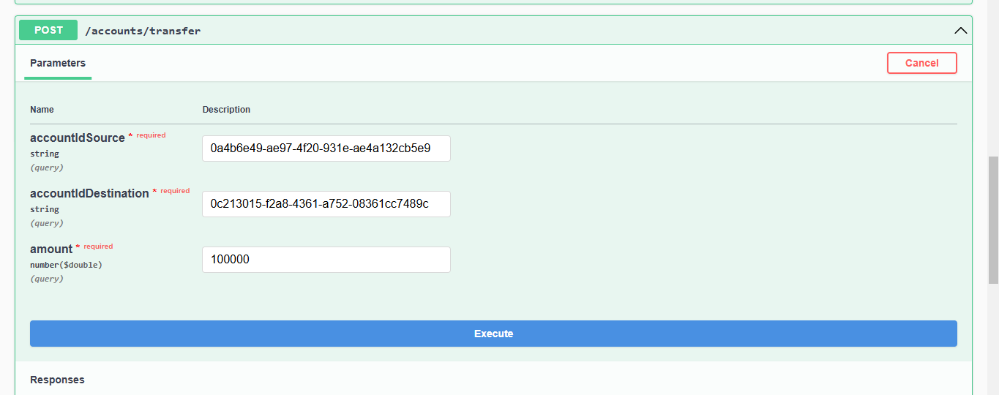

<h1>Projet JEE - Digital Banking</h1>

Ce projet illustre la gestion des comptes bancaires, avec deux types de comptes : Comptes Courants et Comptes Épargnes.

<h2>Gestion des Comptes Bancaires</h2>

<h3>Affichage d'un compte par ID</h3>

<h3>Liste de tous les comptes bancaires</h3>

<h3>Base de données H2</h3>

<h3>Base de données MySQL</h3>

<h2>Gestion des Clients</h2>

<h3>Ajout d'un client</h3>

<h3>Liste des clients</h3>

<h3>Exception : Client non trouvé</h3>

<h3>Suppression d'un client</h3>

<h3>Modification d'un client</h3>
<h4>Avant Modification</h3>

<h4> Après Modification</h4>

<h2>Gestion des Opérations Bancaires</h2>

<h3>Augmenter le solde d'un compte</h3>

<h4>Solde avant l'opération</h3>

<h4>Solde après l'opération</h3>

<h3>Diminuer le solde d'un compte</h3>

<h4>Solde avant l'opération'</h3>

<h4>Solde après l'opération</h3>

<h3>Opérations paginées pour un compte</h3>

<h2>Gestion des Virements</h2>

<h3>Avant le Virement</h3>

<h3>Exécution du Virement</h3>

<h3>Après le Virement</h3>

<h3>Auteur</h3>

Réalisé par : Rahhali Asmaa
